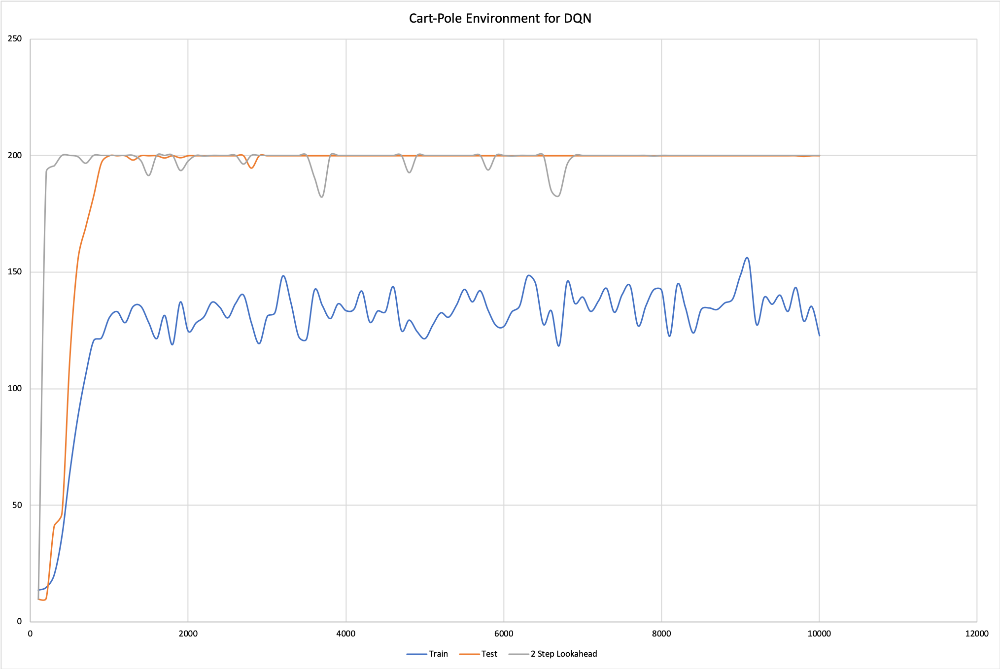
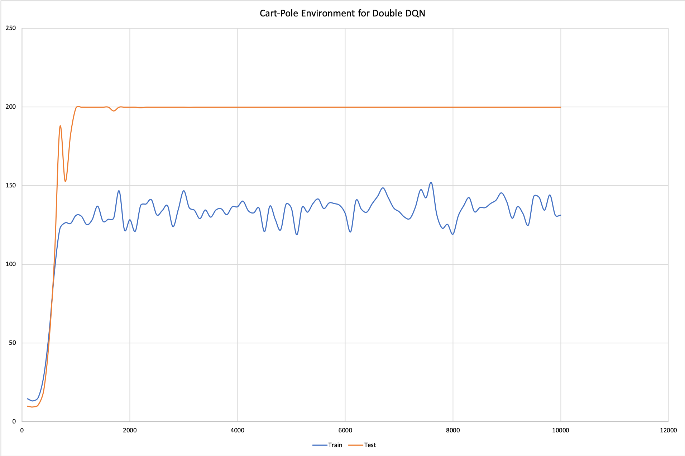
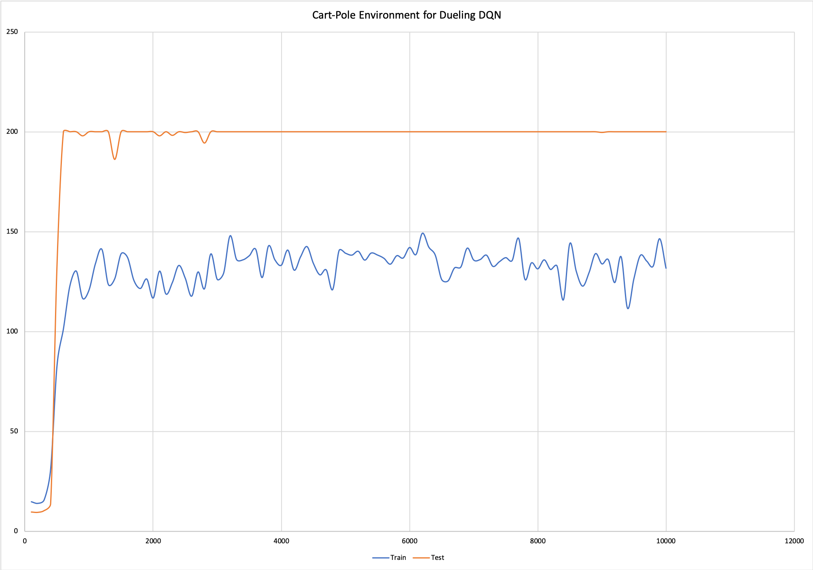
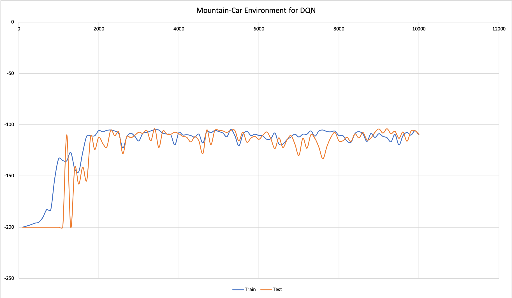
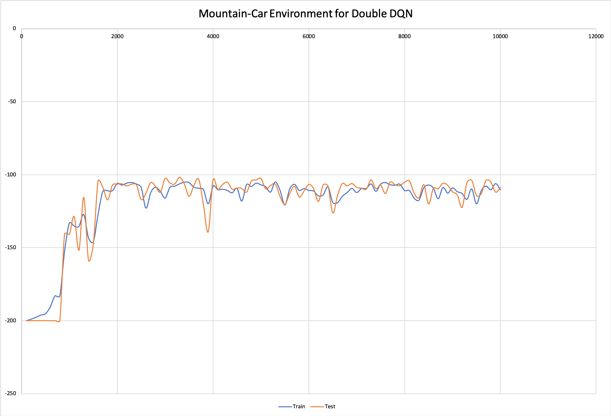
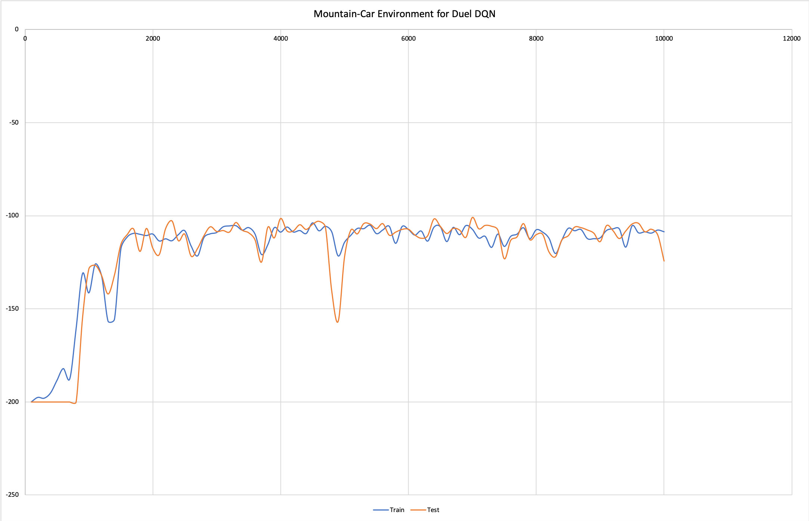

# Deep Reinforcement Learning - Deep Q Networks
Implementing DQN, Double DQN and Duelling Networks on Atari Environments.

# Usage
usage: main.py [-h] [--env ENV] [--render] [--test]
               [--model_episode MODEL_EPI] [--weight_file WEIGHT_FILE]
               [--memory_size MEMORY_SIZE] [--burn_in BURN_IN] [--gamma GAMMA]
               [--batch_size BSZ] [--episodes EPI] [--test_every TEST_EVERY]
               [--test_episodes TEST_EPI] [--save_episodes SAVE_EPI]
               [--eps_init EPSILON_INIT] [--eps_stop EPSILON_STOP]
               [--eps_iter EPSILON_ITER] [--target_update TARGET_UPDATE]
               [--eps_greedy GREEDY_EPSILON] [--lookahead] [--no_reset_dir]
               [--double_dqn] [--duel_dqn] [--decay] [--seed SEED]
               [--logger LOGFILE] [--folder_prefix FOLDER_PREFIX]

Deep Q Network Argument Parser

optional arguments:
  -h, --help            show this help message and exit
  --env ENV 			Choose from one of 'MountainCar-v0' or 'CartPole-v0'
  --render				Whether to render the Atari environment to screen
  --test 				If used, performs the model validation on the given network
  						weights
  --model_episode MODEL_EPI
  						Used as folder prefix for gym Wrapper class
  --weight_file WEIGHT_FILE
  						Initialize model with given weights
  --memory_size memory_size
  						The Replay Memory size.
  --burn_in BURN_IN 	The number of episodes to initialize into the Replay Memory
  						before training.
  --gamma GAMMA 		The decay factor
  --batch_size BSZ 		The number of episode steps to sample for training
  --episodes EPI 		The number of train episodes for the environment
  --test_every TEST_EVERY
  						The train episode interval to test the model after
  --test_episodes TEST_EPI
  						The number of episodes to test the model for in every
  						test interval
  --save_episodes SAVE_EPI
  						The number of train episodes after which a model file
  						is saved
  --eps_init EPSILON_INIT
  						The epsilon start value
  --eps_stop EPSILON_STOP
  						The epsilon final value
  --eps_iter EPSILON_ITER
  						The epsilon iterations for decaying
  --target_update TARGET_UPDATE
  						The number of train episodes after which you update the
  						target model
  --eps_greedy GREEDY_EPSILON
  						The greedy epsilon value to use while testing
  --lookahead			Use this if you want a 2-Step lookahead for testing on
  						CartPole-v0 environment
  --no_reset_dir		Do not reset the model directories
  --double_dqn 			This enables the model to perform Double DQN updates
  						instead of DQN
  --duel_dqn 			This enables to network to calculate value network
  						udpates, and perform Dueling DQN instead of DQN
  						(NOTE: Both double_dqn and duel_dqn can be used together)
  --decay 				This enables epislon decay, else the eps_init is used for
  						the entire training duration
  --seed SEED 			The value to seed the random functions with
  --logger LOGFILE 		The shell output logger file
  --folder_prefix FOLDER_PREFIX
  						The folder prefixes for outputs

# Graphs

